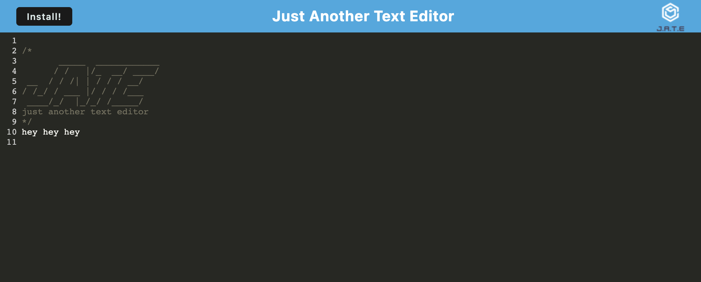

# PWA Text Editor

## Description

This application allowed me to further explore the possibilities of PWA's with offline functionality, and was deployed using Heroku.

## Installation

Once you have ```git clone```ed the repo, run the following commands in an integrated terminal:

```npm install```

```npm run start:dev```

If you are accessing this from the deployed application, simply click the top-left Install button.

## Usage



To run, enter the following commands in an integrated terminal:

```npm run start```

Or simply navigate to https://colinsprows-pwa-text-editor.herokuapp.com/